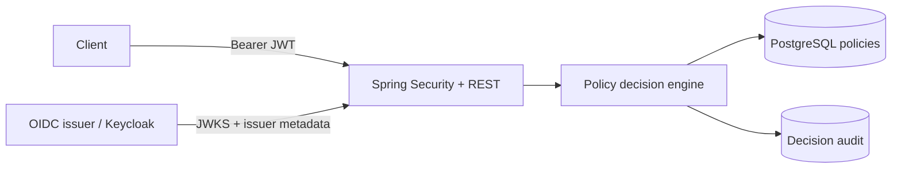

# IAM Policy Service

A deployable Spring Boot policy decision point (PDP) that validates OIDC access tokens and evaluates RBAC + ABAC policies stored in PostgreSQL. It demonstrates Java backend, application security, persistence, testing, containers, CI, threat modeling, and performance testing without implying prior professional Java experience.

## What it proves

- Spring Boot 3 / Java 17 REST API design
- OAuth 2.0 Resource Server and JWT signature, issuer, expiry, and audience-ready validation
- Keycloak-backed local OIDC environment
- RBAC (roles) plus ABAC (request attributes)
- Default-deny and explicit-deny-overrides policy semantics
- PostgreSQL, JPA, Flyway migrations, and decision audit records
- JUnit 5, Mockito, Spring Security tests, and Testcontainers
- Multi-stage distroless, non-root Docker image and Docker Compose
- GitHub Actions test, coverage, image build, and vulnerability scan
- STRIDE threat model and k6 performance test

## Architecture



Keycloak authenticates the API caller. The admin role controls policy management. The PDP evaluates the subject, roles, action, resource, and attributes supplied by a trusted policy-enforcement point (PEP). A real deployment must prevent ordinary end users from inventing their own roles or attributes; see [Threat model](docs/THREAT_MODEL.md).

## Run locally

Requirements: Docker with Compose.

```bash
docker compose up --build -d
docker compose ps
```

Get an administrator token (the imported local realm deliberately issues `http://keycloak:8080` as its issuer, which is reachable by the app container):

```bash
ADMIN_TOKEN=$(curl -s -X POST http://localhost:8081/realms/iam/protocol/openid-connect/token \
  -H 'Content-Type: application/x-www-form-urlencoded' \
  -d 'client_id=iam-cli' -d 'username=admin-user' \
  -d 'password=admin-local-only' -d 'grant_type=password' | jq -r .access_token)
```

Create an RBAC + ABAC policy:

```bash
curl -i -X POST http://localhost:8080/api/v1/policies \
  -H "Authorization: Bearer $ADMIN_TOKEN" -H 'Content-Type: application/json' \
  -d '{"name":"platform-engineers-read-documents","effect":"ALLOW","priority":100,"roles":["engineer"],"actions":["read"],"resourcePattern":"document/*","conditions":{"department":"platform","environment":"prod"},"enabled":true}'
```

Request a decision:

```bash
curl -s -X POST http://localhost:8080/api/v1/decisions \
  -H "Authorization: Bearer $ADMIN_TOKEN" -H 'Content-Type: application/json' \
  -d '{"subject":"alice","roles":["engineer"],"action":"read","resource":"document/42","attributes":{"department":"platform","environment":"prod"}}' | jq
```

Expected result: `allowed: true`. Change `department` or the action and the result becomes default deny.

Stop the stack with `docker compose down`. Add `-v` only when intentionally deleting the local database volume.

## Policy semantics

A policy matches when all are true:

1. At least one requested role matches a policy role (`*` is supported).
2. The action matches (`*` is supported).
3. The resource matches the policy glob, such as `document/*`.
4. Every policy condition exactly matches the corresponding request attribute.

Evaluation uses these rules:

1. Any matching `DENY` wins.
2. Otherwise, the highest-priority matching `ALLOW` wins.
3. No match returns `DENY`.

This engine intentionally supports only exact ABAC conditions. A constrained model is easier to audit than arbitrary expression execution. Range, time, ownership, and relationship operators are sensible future work.

## API

| Method | Path | Required access | Purpose |
|---|---|---|---|
| GET | `/actuator/health` | Public | Liveness/readiness |
| GET/POST | `/api/v1/policies` | `policy-admin` role | List/create policies |
| GET/PUT/DELETE | `/api/v1/policies/{id}` | `policy-admin` role | Read/update/delete policy |
| POST | `/api/v1/decisions` | Valid JWT | Evaluate access |

## Test

```bash
mvn clean verify
```

The unit suite tests allow, deny-overrides, and default-deny behavior. Integration tests start a real PostgreSQL container, run Flyway, exercise REST endpoints, and verify authentication/authorization. If Docker is unavailable, the Testcontainers integration class is skipped; CI must run it with Docker.

JaCoCo enforces 70% line coverage at `verify`. Coverage is evidence, not proof of security; policy edge cases and mutation testing would strengthen the suite.

## Load test

Follow [docs/LOAD_TEST.md](docs/LOAD_TEST.md). The committed k6 script defines a reproducible workload and pass/fail thresholds. No fabricated benchmark numbers are claimed; results depend on the machine and must be recorded after an actual run.

## Production gaps

- Enforce the expected JWT `aud` claim for the production client/API.
- Accept subject attributes only from a trusted PEP or resolve them server-side.
- Use TLS, secret management, network policies, rate limiting, and database encryption/backup.
- Add pagination, optimistic locking, policy versioning, admin audit events, and audit retention controls.
- Cache compiled policies with safe invalidation before high-scale use.
- Export Prometheus metrics and add SLO-based alerts.

## Portfolio wording

> Built a Spring Boot IAM policy decision service with OIDC/JWT authentication, RBAC/ABAC evaluation, default-deny semantics, PostgreSQL/Flyway persistence, decision auditing, JUnit/Testcontainers integration tests, Docker Compose, CI security scanning, STRIDE threat modeling, and a reproducible k6 load test.

That describes a project. It does not claim professional Java work experience.
